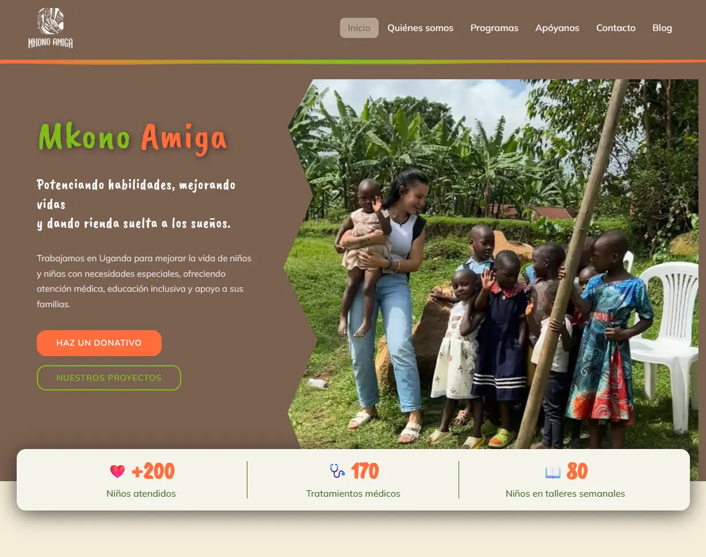

# Mkono Amiga — Sitio web oficial



Sitio web de **Mkono Amiga**, asociación sin ánimo de lucro española que trabaja en el distrito de Buhweju (Uganda) por los derechos y la dignidad de niños y niñas con discapacidad.

🌍 [mkonoamiga.org](https://mkonoamiga.org)

---

## Tecnologías

- **React 18** + **Vite**
- **React Router v6** — navegación SPA
- **SCSS** con arquitectura BEM y `@use` modules
- **react-helmet-async** — SEO dinámico por página
- **Embla Carousel** — carrusel de imágenes
- **Web3Forms** — formulario de contacto sin backend
- **Netlify** — hosting y deploy continuo desde GitHub

---

## Estructura del proyecto

```
src/
├── components/
│   ├── Navbar/          # Barra de navegación responsive
│   ├── Footer/          # Pie de página
│   ├── SEO/             # Meta tags dinámicos por página
│   ├── CTADonacion/     # Bloque llamada a la acción reutilizable
│   ├── PanelDonacion/   # Panel con métodos de donación
│   └── PaginaLegal/     # Layout para páginas legales
├── pages/
│   ├── Inicio/          # Portada
│   ├── QuienesSomos/    # Historia, misión, equipo y mapa
│   ├── Programas/       # Seis programas de acción + galería
│   ├── Apoyanos/        # Formas de colaborar y transparencia
│   └── Contacto/        # Formulario y panel de donaciones
├── data/                # Contenido separado de la UI
└── styles/              # Variables, mixins y estilos globales
```

---

## Instalación y desarrollo

```bash
# Instalar dependencias
npm install

# Servidor de desarrollo
npm run dev

# Build de producción
npm run build
```

---

## Variables de entorno

Crea un archivo `.env` en la raíz con:

```
VITE_WEB3FORMS_KEY=tu_clave_de_web3forms
VITE_SITE_URL=https://mkonoamiga.org
```

La clave de Web3Forms se obtiene en [web3forms.com](https://web3forms.com) y debe estar configurada también en las variables de entorno de Netlify.

---

## Deploy

El deploy es automático: cada push a `main` lanza un nuevo build en Netlify.

Para hacer build manual:

```bash
npm run build
# genera la carpeta dist/
```
